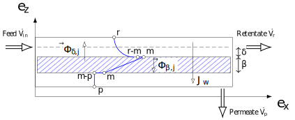

=========================================
pymembrane Documentation
=========================================

Welcome to the ``pymembrane`` documentation version |release|. 

This module is a Python library for modeling, simulating and optimizing spiral membrane-based processes.

.. container:: important custom-box

   |version_badge|

   **Author**: Hedi Romdhana  

   **Email**: hedi.romdhana@agroparistech.fr

.. contents::
    :local:

Elementary mass transfers in a spiral membrane
----------------------------------------------

The diagram above depicts the mass transfer phenomena taking place in a spiral membrane.

- **Feed flow** (:math:`\dot{V}_{in}`): The feed enters the membrane module containing water and solutes and flows in the direction of :math:`\vec{e}_x`, parallel to the membrane surface, through both retentate and permeate channels.
- **Retentate** (:math:`\dot{V}_{r}`): The retentate flow travels along the membrane and contains the solutes that are rejected by the membrane, leading to an increase in solute concentration along the membrane length. In the retentate side, the **mass boundary layer** (:math:`\delta`) is formed, and **diffusive flux** (:math:`\Phi_{\delta, j}`) occurs back towards the bulk due to concentration polarization.
- **Permeate** (:math:`\dot{V}_{p}`): The permeate stream contains water and a reduced concentration of solutes. Solutes pass through the membrane (:math:`\beta`) with **diffusive flux** (:math:`\Phi_{\beta, j}`) across the membrane thickness.
- **Mass boundary layer** (:math:`\delta`): A boundary layer forms in the retentate side due to the accumulation of solutes, generating a diffusive flux (:math:`\Phi_{\delta, j}`) directed away from the membrane.
- **Membrane thickness** (:math:`\beta`): The thickness of the membrane (:math:`\beta`) represents resistance for the solutes, where diffusion of solutes happens from the retentate-membrane interface to the permeate-membrane interface.
- **Transmembrane flux** (:math:`J_w`): Represents the water flux driven by **transmembrane pressure**. The presence of solutes creates **osmotic pressure** differences that influence this flux.

Setup
=====
.. image:: https://img.shields.io/badge/PyPI-pymembrane-blue.svg
   :target: https://pypi.org/project/pymembrane/
   :alt: pymembrane on PyPI
   :align: left

To install ``pymembrane``, you can use ``pip`` from PyPI:

.. code-block:: bash

    pip install pymembrane

If you want to upgrade to the latest version, use the following command:

.. code-block:: bash

    pip install --upgrade pymembrane

Make sure to have Python 3.7 or a later version.

pymembrane Module
=================

This module defines classes and functions to simulate spiral membrane filtration processes.

spiral_membrane
---------------
.. class:: spiral_membrane(**args)

    A class that simulates the spiral membrane filtration process.

    .. container:: parameter-box

        .. list-table:: Parameters
           :widths: 25 50 25
           :header-rows: 1
           :class: param-table

           * - **Parameter**
             - **Description**
             - **Unit**
           * - **Patm** ``float``
             - Atmospheric pressure 
             - ``bar``
           * - **Pin** ``float``
             - Inlet pressure 
             - ``bar``
           * - **T** ``float``
             - Inlet temperature 
             - ``°C``
           * - **L** ``float``
             - Membrane length 
             - ``m``
           * - **S** ``float``
             - Membrane area 
             - ``m²``
           * - **DP** ``float``
             - Pressure loss across the membrane 
             - ``bar``
           * - **Aw** ``float``
             - Water permeability 
             - ``m/h/bar``
           * - **Vin** ``float``
             - Inlet volumetric flow rate 
             - ``m³/h``
           * - **solutes** ``list``
             - List of solutes
             - 
           * - **Cin** ``list``
             - Inlet solute concentrations 
             - ``mol/m³``
           * - **B** ``list``
             - Membrane mass transfer coefficients 
             - ``m/h``
           * - **k** ``list``
             - Boundary layer mass transfer coefficients 
             - ``m/h``

    .. container:: returns-box

        .. list-table:: Returns
           :widths: 17 75 8
           :header-rows: 1
           :class: return-table

           * - **Return**
             - **Description**
             - **Unit**
           * - **Vr_out** ``float``
             - Retentate volumetric flow rate at the membrane outlet 
             - ``m³/h``
           * - **Vp_out** ``float``
             - Permeate volumetric flow rate at the membrane outlet 
             - ``m³/h``
           * - **Cr_out** ``ndarray``
             - Solute concentrations in the retentate at the membrane outlet
             - ``mol/m³``
           * - **Cp_out** ``ndarray``
             - Solute concentrations in the permeate at the membrane outlet
             - ``mol/m³``
           * - **FRV** ``ndarray``
             - Flow rate volume ratio along the membrane
             - 
           * - **T** ``ndarray``
             - Transmission coefficient along the membrane
             - ``mol/mol``
           * - **R** ``ndarray``
             - Rejection coefficient along the membrane
             - ``-``
           * - **FRV_out** ``float``
             - Flow rate volume ratio at the membrane outlet
             - ``-``
           * - **T_out** ``ndarray``
             - Transmission coefficient at the membrane outlet
             - ``mol/mol``
           * - **R_out** ``ndarray``
             - Rejection coefficient at the membrane outlet
             - ``-``
           * - **net_balance** ``float``
             - Net volumetric mass balance
             - ``m³/h``
           * - **solute_net_balance** ``ndarray``
             - Solute mass balance
             - ``mol/h``

.. method:: spiral_membrane.calcul(solver_method='taylor', taylor_terms=2)

        Simulates the filtration process.

        .. container:: parameter-box

          .. list-table:: Parameters
              :widths: 25 75 
              :header-rows: 1
              :class: return-table

              * - **solver_method** ``str``
                - The method used for solving concentration at the membrane interface.

              * -
                - Options are ``'fsolve'``, ``'root'``, ``'taylor'`` (default), ``'fixed_point'``.
              
              * - **taylor_terms** ``int``
                - Number of terms to use in the Taylor series approximation (if applicable).

Exemples
========

Instantiate ``spiral_membrane`` class
-------------------------------------

In this example, we demonstrate how to initialize and configure the ``spiral_membrane`` class from the ``pymembrane`` module to simulate a membrane filtration process. The parameters are set for a spiral membrane, and solute-specific details are provided. Finally, the properties of the initialized object are printed to illustrate the initial configuration.

.. code-block:: python
   :linenos:

   from pymembrane.membrane import membrane

   # Instantiate the spiral membrane object with key parameters
   sm = membrane.spiral_membrane(
       L=4.5,        # Length of the membrane in meters
       DP=0.5,       # Pressure loss across the membrane in bar
       S=118.5,      # Membrane area in m²
       Pin=9.5,      # Inlet pressure in bar
       Vin=10.0,     # Inlet volumetric flow rate in m³/h
       T=25          # Inlet temperature in °C
                                )

   # Specify the solutes present in the feed solution
   sm.solutes = ['sucrose', 'fructose', 'lactic acid']

   # Set the membrane mass transfer coefficients (B) for each solute in m/h
   sm.B = [0.000144, 5.4e-05, 0.00027]

   # Set the boundary layer mass transfer coefficients (k) for each solute in m/h
   sm.k = [0.036, 0.0432, 0.0684]

   # Set the inlet concentrations of each solute in the feed stream in mol/m³
   sm.Cin = [0.1454, 2.4083, 3.5628]

   # Print the details of the membrane configuration
   print(sm)

``print(sm)`` is used to display the initialized configuration of the `spiral_membrane` object.
It provides a summary of all the parameters, solutes, and coefficients defined above. 

**Expected Output**:

.. code-block:: text

    +---------------+----------------------------------------+---------+------------------------------+
    | Vin           | 10.000                                 | m³/h    | Inlet flow rate              |
    | T             | 25.0                                   | °C      | Inlet temperature            |
    | Patm          | 1.0                                    | bar     | Atmospheric pressure         |
    | Pin           | 9.5                                    | bar     | Inlet pressure               |
    | S             | 118.50                                 | m²      | Membrane area                |
    | L             | 4.50                                   | m       | Membrane length              |
    | Aw            | 5.300e-03                              | m/h/bar | Water permeability           |
    | DP            | 0.500                                  | bar     | Pressure loss                |
    | Cin           | [0.145, 2.408, 3.563]                  | mol/m³  | Inlet solute concentrations  |
    | solutes       | ['sucrose', 'fructose', 'lactic acid'] |         | Solutes list                 |
    | B             | [0.000144, 5.4e-05, 0.00027]           | m/h     | Membrane mass transfer       |
    | k             | [0.036, 0.0432, 0.0684]                | m/h     | Boundary layer mass transfer |
    +---------------+----------------------------------------+---------+------------------------------+

Membrane simulation
-------------------

.. code-block:: python
    :linenos:
    :emphasize-lines: 2

    # Run the membrane simulation
    sm.calcul()
    # Print the summary results after the simulation
    print(sm.res)

**Expected Output**:

.. code-block:: text

    +--------------------+-----------------------+---------+----------------------+
    | Vr_out             | 5.100                 | m3/h    | retentate flowrate   |
    | Vp_out             | 4.900                 | m3/h    | permeate flowrate    |
    | Cp_out             | [0.002, 0.011, 0.058] | mol/m3  | solutes in permeate  |
    | Cr_out             | [0.283, 4.711, 6.93]  | mol/m3  | solutes in retentate |
    | calculation_time   | 0.031                 | s       | calculation time     |
    | net_balance        | 2.665e-15             | m3/h    | net mass balance     |
    | solute_net_balance | [0.0, 3.553e-15, 0.0] | mol/h   | solute net balance   |
    | FRV_out            | 1.961                 | -       | FRV                  |
    | R_out              | [0.992, 0.998, 0.992] | -       | rejection            |
    | T_out              | [0.008, 0.002, 0.008] | mol/mol | transmission         |
    +--------------------+-----------------------+---------+----------------------+

Volume flowrate profiles
------------------------
In this example, we visualize the flow rate profiles of the retentate and permeate along the length of the membrane.

.. code-block:: python
    :linenos:
    :emphasize-lines: 2, 3

    import matplotlib.pyplot as plt
    plt.plot(sm.res.x[0:], sm.res.Vr[0:], label="Retentate")
    plt.plot(sm.res.x[0:], sm.res.Vp[0:], label="Permeate")
    plt.xlabel("Membrane position [m]")
    plt.ylabel("Volume flowrate [m³/h]")
    plt.grid()
    plt.legend()
    plt.show()

**Expected Plot**:

.. plot::
    :caption: Flowrate profiles along the membrane

    from pymembrane.membrane import membrane

    # Instantiate the spiral membrane object with key parameters
    sm = membrane.spiral_membrane(
        L=4.5,        # Length of the membrane in meters
        DP=0.5,       # Pressure loss across the membrane in bar
        S=118.5,      # Membrane area in m²
        Pin=9.5,      # Inlet pressure in bar
        Vin=10.0,     # Inlet volumetric flow rate in m³/h
        T=25          # Inlet temperature in °C
    )

    # Specify the solutes present in the feed solution
    sm.solutes = ['sucrose', 'fructose', 'lactic acid']

    # Set the membrane mass transfer coefficients (B) for each solute
    sm.B = [0.000144, 5.4e-05, 0.00027]  # in m/h

    # Set the boundary layer mass transfer coefficients (k) for each solute
    sm.k = [0.036, 0.0432, 0.0684]       # in m/h

    # Set the inlet concentrations of each solute in the feed stream
    sm.Cin = [0.1454, 2.4083, 3.5628]     # in mol/m³

    # Calculate the spiral membrane process
    sm.calcul()
    import matplotlib.pyplot as plt

    # Plot the retentate and permeate volume flowrate profiles along the membrane
    plt.plot(sm.res.x[0:], sm.res.Vr[0:], label="Retentate")
    plt.plot(sm.res.x[0:], sm.res.Vp[0:], label="Permeate")
    plt.xlabel("Membrane position [m]", fontsize=14)
    plt.ylabel("Volume flowrate [m³/h]", fontsize=14)
    plt.grid()
    plt.legend(fontsize=14)
    plt.tight_layout()
    plt.show()

Retention profiles of solutes
-----------------------------

In this second example, we demonstrate how to plot the retention profiles (Retention rate) of each solute along the membrane.

.. code-block:: python
    :linenos:

    for i in range(len(sm.solutes)):
        plt.plot(sm.res.x[1:],sm.res.R[i,1:],label=sm.solutes[i])

**Expected Plot**:

.. plot::
   :caption: Retention of solutes along the membrane

   import matplotlib.pyplot as plt
   from pymembrane.membrane import membrane

   # Initialize the spiral membrane object
   sm = membrane.spiral_membrane(
       L=4.5, DP=0.5, S=118.5, Pin=9.5, Vin=10.0, T=25
   )

   # Specify solutes, mass transfer coefficients, and inlet concentrations
   sm.solutes = ['sucrose', 'fructose', 'lactic acid']
   sm.B = [0.000144, 5.4e-05, 0.00027]
   sm.k = [0.036, 0.0432, 0.0684]
   sm.Cin = [0.1454, 2.4083, 3.5628]

   # Run the simulation
   sm.calcul()

   # Plot the retention profiles
   for i in range(len(sm.solutes)):
       plt.plot(sm.res.x[1:], sm.res.R[i, 1:], label=sm.solutes[i])

   plt.xlabel("Membrane position [m]", fontsize=14)
   plt.ylabel("Retention rate", fontsize=14)
   plt.grid()
   plt.legend(fontsize=14)
   plt.tight_layout()
   plt.show()

